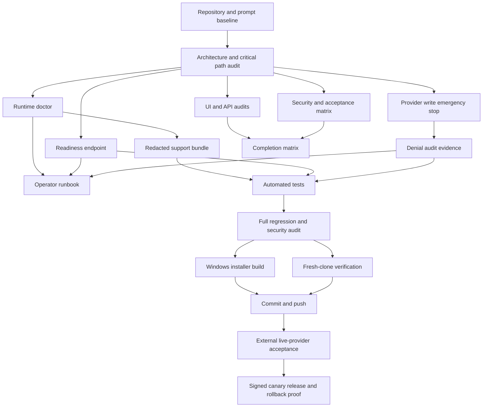

# Task Graph

External account authorization, production infrastructure, code-signing keys, and provider consent cannot be fabricated by repository code. They remain explicit successors to the pushed implementation.
